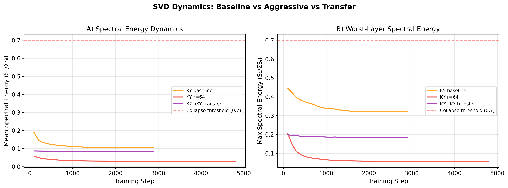
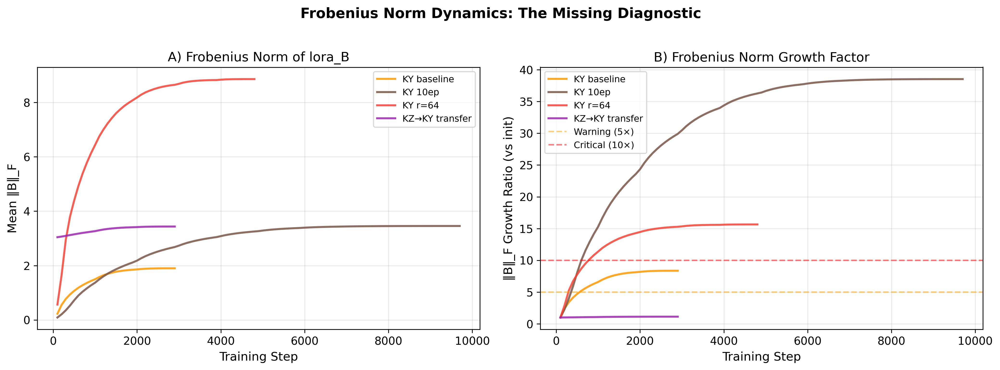

# Spectral Collapse Without Collapse

**SVD Dynamics of LoRA Adapters for Low-Resource Turkic Languages**

*Zarina Uvalieva*

> Paper: `paper/main.pdf` | Target: EMNLP 2026 Findings (ARR submission)

---

## Key Findings

We fine-tune **Gemma-2-9B** (4-bit QLoRA) on three Turkic languages and monitor LoRA adapter spectral dynamics via SVD. Three principal results:

1. **Spectral energy threshold refuted.** No experiment exceeds SE = 0.59 (well below the proposed 0.7 threshold from Biderman et al., 2024), yet r=64 configurations suffer complete functional collapse (NER F1 = 0, cross-lingual PPL > 600).

2. **Frobenius norm growth as diagnostic.** Pathological configurations exhibit 15-38x norm growth vs. 1.13x for the best transfer setup. We propose preliminary thresholds: >5x warning, >10x stop.

3. **Cross-lingual transfer works.** Kazakh → Kyrgyz sequential transfer yields +61% NER F1 (0.253 vs. 0.157) while retaining Kazakh knowledge (PPL 23.5 vs. 47.6).

## Results Summary

| Experiment | Target PPL | NER F1 (KY) | KZ PPL | Frob. Growth |
|:-----------|:----------:|:-----------:|:------:|:------------:|
| KZ Baseline (E1) | 2.73 | 0.219 | 2.73 | ~8x |
| UZ Baseline (E2) | 4.03 | 0.138 | 64.44 | ~8x |
| KY Baseline (E3) | 4.78 | 0.157 | 47.58 | ~8x |
| KY Overfit 10ep (E4) | 4.18 | 0.173 | 87.65 | ~8x |
| KY r=64 (E5) | 5.90 | 0.000 | 659.25 | 15-38x |
| KZ→KY Transfer (E6) | 4.73 | **0.253** | **23.49** | **1.13x** |

## Figures

<p align="center">
  
  
</p>
<p align="center">
  <em>Left: Spectral energy never reaches 0.7 threshold. Right: Frobenius norm separates healthy from pathological training.</em>
</p>

## Repository Structure

```
Spectral-Collapse-Turkic/
├── paper/
│   ├── main.tex              # Full paper (ACL format)
│   ├── main.pdf              # Compiled PDF
│   └── references.bib        # Bibliography
├── scripts/
│   ├── train_svd.py          # Training with SVD monitoring callback
│   ├── evaluate.py           # Post-training evaluation (PPL, NER, TUMLU)
│   ├── plot_final.py         # Publication-quality figures
│   ├── prepare_kz_uz_data.py # Data collection (KZ, UZ)
│   ├── rebuild_uzbek.py      # Uzbek corpus construction
│   └── analyze_datasets.py   # Dataset statistics
├── figures/                  # All 9 publication figures
├── experiments/              # Training logs and eval results (no checkpoints)
│   ├── kz_baseline_r16/
│   ├── uz_baseline_r16/
│   ├── ky_baseline_r16/
│   ├── ky_overfit_10ep/
│   ├── ky_collapse_r64/
│   └── ky_from_kz_transfer/
├── requirements.txt
└── README.md
```

## Experimental Setup

| Component | Details |
|-----------|---------|
| Base Model | Gemma-2-9B (4-bit NF4, bfloat16) |
| LoRA | Rank 16/64, α=2r, 7 target modules per layer |
| Data | ~150 MB per language (KY, KZ, UZ) |
| SVD Monitor | Every 100 steps: SE, effective rank, stable rank, entropy, Frobenius norm |
| Evaluation | Perplexity, WikiANN NER (3-shot), TUMLU QA (5-shot) |
| Hardware | NVIDIA RTX 5080 (16 GB) |

## Subword Fragmentation

| Language | Tokens/Word | vs. English |
|----------|:-----------:|:-----------:|
| English  | 1.15 | 1.00x |
| Uzbek    | 3.68 | 3.20x |
| Kyrgyz   | 3.69 | 3.21x |
| Kazakh   | 3.74 | 3.25x |

## Quick Start

```bash
pip install -r requirements.txt

# Train with SVD monitoring
python scripts/train_svd.py \
    --lang ky \
    --data_path data/pretrain/ky_final.jsonl \
    --output_dir output_ky_baseline \
    --rank 16 --lr 2e-4 --epochs 3

# Evaluate
python scripts/evaluate.py --adapter_path output_ky_baseline/final_adapter

# Generate figures
python scripts/plot_final.py
```

## Data

Training corpora (~150 MB each) are not included due to size. Sources:

| Language | Source |
|----------|--------|
| Kazakh | Kazakh Wikipedia + sozkz-corpus (61,879 records, 14.1M tokens) |
| Kyrgyz | Curated local corpus: literature, history, encyclopedic (17,360 records, 4.4M tokens) |
| Uzbek | uz-books + Uzbek Wikipedia + FineWeb-2 Cyrillic (21,242 records, 5.4M tokens) |

## Citation

```bibtex
@inproceedings{uvalieva2026spectral,
  title={Spectral Collapse Without Collapse: {SVD} Dynamics of {LoRA} Adapters for Low-Resource Turkic Languages},
  author={Uvalieva, Zarina},
  booktitle={Findings of the Association for Computational Linguistics: EMNLP 2026},
  year={2026}
}
```

## License

MIT License. For academic research purposes.
